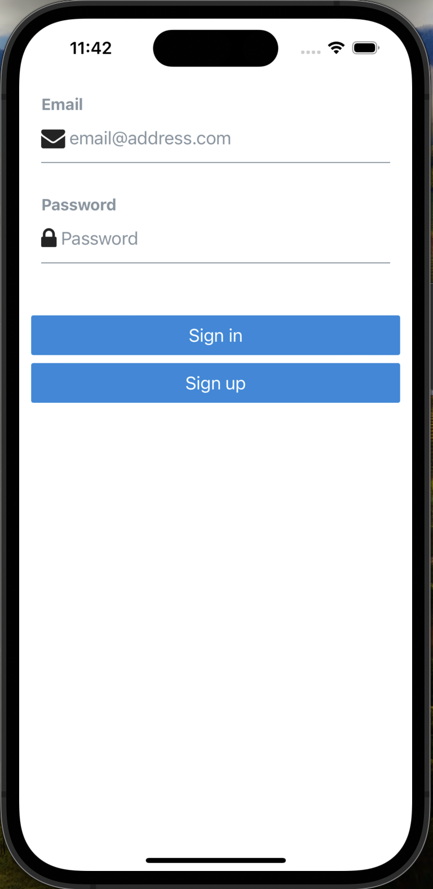
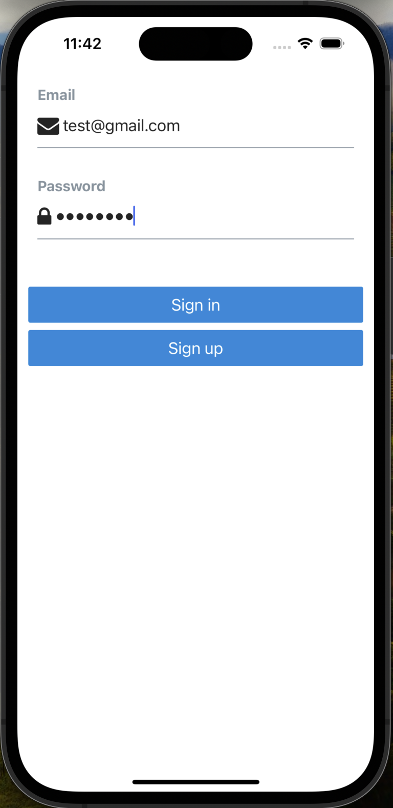
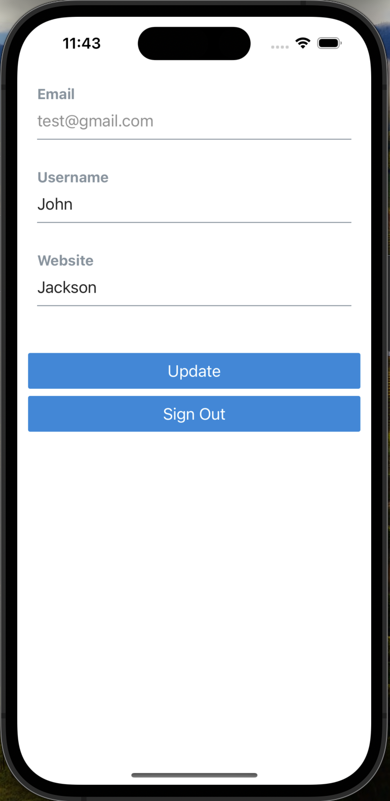

<!-- ABOUT THE PROJECT -->

<div class="images" align="center">
    <h1>User Management App</h1>
    
    
    
</div>

Built using React Native and the Expo build environment toolkit to run natively on iOS and Android devices. Uses Supabase for user authentication via email and password, as well as database storage via Postgres. 

<!-- GETTING STARTED -->
## Getting Started

If you want to clone this project and run it for yourself, you will need to install and configure a couple of things before you get started. Importantly, if you wish to run a device simulator on your computer, you need to install either [Android Studio](https://developer.android.com/studio) or [Xcode](https://developer.apple.com/xcode/).

### Prerequisites

Run the following commands to install the necessary software and dependencies via the Homebrew package manager
* npm
  ```sh
  brew install node
  ```
* Xcode
  ```sh
  xcode-select --install
  ```
* Supabase
  ```sh
  brew install supabase/tap/supabase
  ```

### Getting Started

1. Make sure you have all prerequisites installed and configured
2. Clone the repo
   ```sh
   git clone https://github.com/james-clarke/user-manager.git
   ```
3. Initialize the project
   ```
   cd user-manager
   supabase init
   supabase start
   ```
4. Install NPM packages
   ```sh
   npm install
   ```
5. Run the app, if it's your first time you may need to build
   ```sh
   npx expo build:[ios|android]
   npm run:[ios|android]
   ```

## Contact

James Clarke - jclarkie23@icloud.com

Project Link: [https://github.com/james-clarke/user-manager](https://github.com/james-clarke/user-manager)
